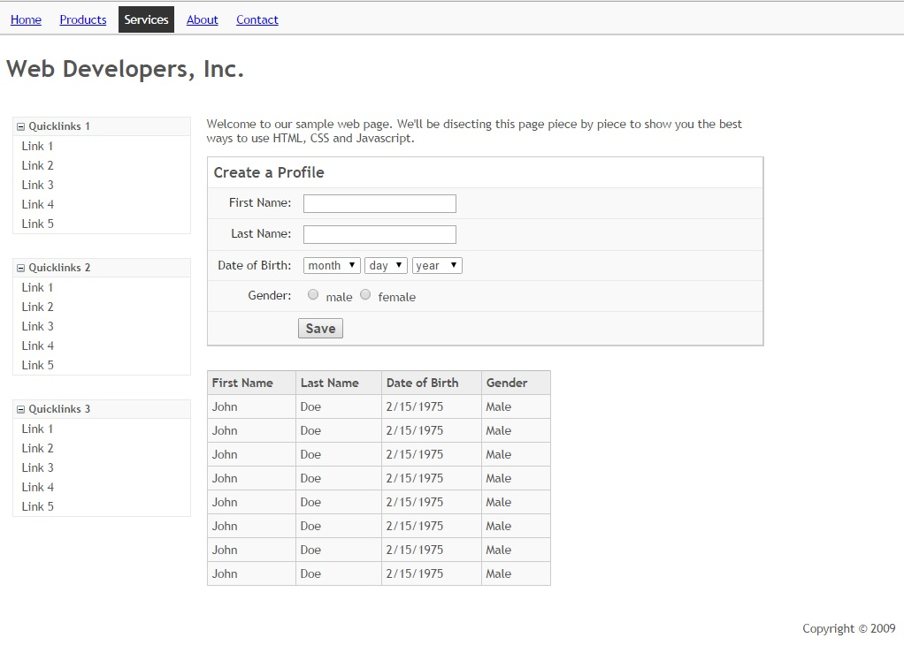

Web-Development-Fundamentals
============================

This tutorial is based on the material HTML/CSS/JavaScript from the Group Up by Google, found [here](https://www.youtube.com/playlist?list=PL697D36B35F92E9E4).

Introduction
----------------------------

First of all, lets take a look at what we use HTML, CSS and JavaScript (also known as JS) for.

The User Interface (UI) is the interface that we, as users, interact with. For web applications this is done through a web browser, like the one you're using to read this with. The UI is made up of 3 parts:
  1. *Structure* - The content of the UI.
  2. *Presentation* - How the content is displayed.
  3. *Behaviour* - How the content behaves when certain actions occur.

These 3 components correspond to the 3 technologies we're going to be looking at:
  1. *Structure* - HTML
  2. *Presentation* - CSS
  3. *Behaviour* - JavaScript

Web pages used to have these 3 technologies jumbled together, in short, it was a nightmare. Over time practices have changed so that now our HTML, CSS and JS are all separated.

This means that if we want to change how a website looks, we need to only swap out the corresponding CSS files, and any images used instead of having to root through HTML files looking for all CSS references.

###Why?
* _Accessibility_ - easy to use with screen readers and other accessibility devices
* _Portability_ - easy to make a web page support mobile or tablet formats
* _Maintainability_ - easy to make changes to on component without much effect on the others
* _Reduced Latency_ - we can use caching techniques to have browsers download the CSS or JS files once, and check after a determined expiry period, meaning they don't have to download them every time they visit.
* _Graceful Degradation_ - The web page will still function if the CSS or JS files don't get loaded in, for whatever reason.

Let's take a look at a website that does this [here](http://webremix.org/labs/lab2/demos/demo.html) or just follow along with the screen shots below.

As you can see, the page has an interactive navigation bar at the top that highlights whatever is hovered over, and displays a list of items under the 'Contact' tab.
It also has lists of links on the left that can be shrunk or expanded by clicking on the '-' or '+' buttons, this is provided by JavaScript.
There is also a form for submitting data and table for displaying it.

